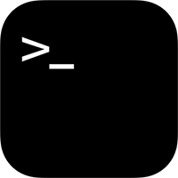

<p align="center">

</p>

<h1 align="center">OpenTerm</h1>

<p align="center">
<a href="https://itunes.apple.com/app/terminal/id1323205755?mt=8&at=1010lII4"></a>
<br><span align="center">(Previously called Terminal for iOS)</span>

</p>

<p align="center">
<a href="https://developer.apple.com/swift/"></a>


<a href="https://travis-ci.org/louisdh/terminal"></a>
<br>
<a href="http://twitter.com/LouisDhauwe"></a>
<a href="https://paypal.me/louisdhauwe"></a>
</p>

## About
This is a sandboxed command line interface for iOS. 


Commands included:

|            |            |            |            |
| ---------- | ---------- | ---------- | ---------- |
| awk        | cat        | cd         | chflags    |
| chksum     | clear      | compress   | cp         |
| curl       | date       | du         | echo       |
| egrep      | env        | fgrep      | grep       |
| gunzip     | gzip       | help       | link       |
| ln         | ls         | mkdir      | mv         |
| open-url   | printenv   | pwd        | readlink   |
| rm         | rmdir      | scp        | sed        |
| setenv     | sftp       | share      | ssh        |
| stat       | sum        | tar        | tee        |
| touch      | tr         | uname      | uncompress |
| unsetenv   | uptime     | wc         | whoami     |

## Dependencies
This project uses a modified version of [ios_system](https://github.com/holzschu/ios_system), which requires OpenSSL.

To set up dependencies, run `bootstrap.sh`.

## Running
Open `OpenTerm.xcworkspace`, change the bundle identifier to an identifier linked to your Apple developer account in order to run. Build using the `OpenTerm` scheme. 

### Device
Please note that by default you can only build for arm64. No further action is required.

### Simulator
To build for the iOS simulator, run:

```bash
./Dependencies/ios_system/Frameworks/prepare_simulator.sh
```
This will copy the necessary dependencies for the x86_64 architecture.

## License

This project is available under the MIT license. See the LICENSE file for more info.
